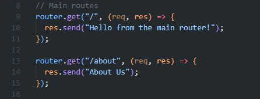
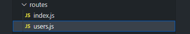

# Objectives

Set up a new Express server.
Use Express Router to organize routes.
Handle route parameters.
Create a basic nested route structure.

# Instructions
## Project Initialization

Create a new directory named express-routing.

Navigate into the directory.

Initialize a new Node.js project.
  

Install Express.
  

Create a file named data.json and add the following sample data:

[
  {
    "id": 1,
    "name": "John Doe",
    "email": "john.doe@example.com",
    "role": "admin",
    "profile": {
      "age": 30,
      "location": "New York",
      "interests": ["coding", "hiking", "reading"]
    }
  },
  {
    "id": 2,
    "name": "Jane Smith",
    "email": "jane.smith@example.com",
    "role": "user",
    "profile": {
      "age": 25,
      "location": "San Francisco",
      "interests": ["traveling", "music", "sports"]
    }
  },
  {
    "id": 3,
    "name": "Sam Johnson",
    "email": "sam.johnson@example.com",
    "role": "moderator",
    "profile": {
      "age": 28,
      "location": "Chicago",
      "interests": ["gaming", "movies", "technology"]
    }
  },
  {
    "id": 4,
    "name": "Alice Brown",
    "email": "alice.brown@example.com",
    "role": "user",
    "profile": {
      "age": 22,
      "location": "Austin",
      "interests": ["art", "photography", "yoga"]
    }
  },
  {
    "id": 5,
    "name": "Michael Green",
    "email": "michael.green@example.com",
    "role": "user",
    "profile": {
      "age": 35,
      "location": "Seattle",
      "interests": ["cooking", "gardening", "cycling"]
    }
  }
]
  

## Create the Server

Create a file named index.js.
  

Set up a basic Express server that listens on port 3000.
  

Create a basic route that responds with "Hello, World!" at the root URL.
  

## Organize Routes Using Express Router

Create a directory named routes.
  

Inside the routes directory, create a file named index.js.
  

In index.js, set up a router that handles:

A GET request at the root URL (/) that responds with "Hello from the main router!".
A GET request at /about that responds with "About Us".
  

Import and use the router in the main index.js file.
  

## Handle Route Parameters

Modify the router to handle a GET request at /user/:id that responds with the user ID.
  

Test this route by navigating to URLs like http://localhost:3000/user/123.
  

## Create Nested Routes

Inside the routes directory, create a file named users.js.
  

Set up the users.js router to handle:

A GET request at the root URL (/users) that responds with "List of all users".
A GET request at /:id that responds with the user ID.
  

Modify the main router (index.js) to use the users.js router for routes starting with /users.
  

## Test the Routes

Start the server using Nodemon.
  

Test the following routes:
http://localhost:3001/ - Should display "Hello from the main router!".
  

http://localhost:3001/about - Should display "About Us".
  

http://localhost:3001/user/123 - Should display "User ID: 123".
  

http://localhost:3001/users - Should display "List of all users".

http://localhost:3001/users/123 - Should display "User ID: 123".

# Submission Guidelines
Create a new GitHub repository named express-routing.
Push your project to the repository.
Submit the link to your GitHub repository.

# Credits
Credit to ChatGPT for assistance and code comments.